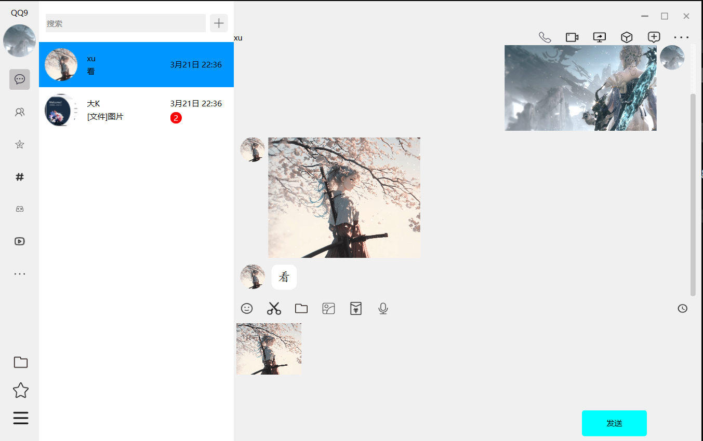
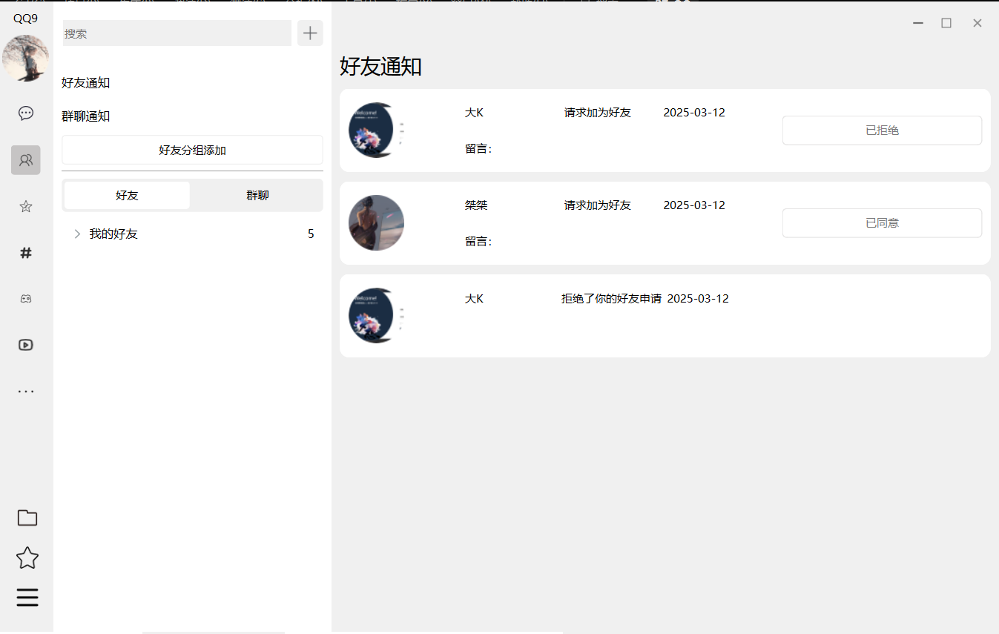
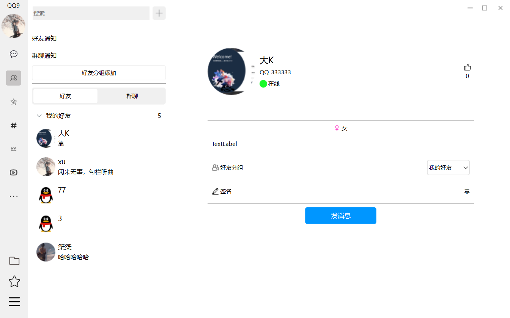

#基于Qt框架的仿QQ即时通信应用
	基于Qt框架开发的仿QQ即时通信系统，系统采用C/S架构，实现账号管理、好友/群组管理及实时消息传输，搜索等功能。Qt客户端采用QSS样式表，自定义控件等进行界面美化，通过QWebSocket与后端通信，后端基于QHttpServer处理HTTP请求，使用JSON进行数据传输。采用JWT技术实现安全认证，通过数据库连接池优化MySQL访问效率。

登录界面

通信界面

群组通信界面

搜索添加界面

好友搜索栏

通知界面

好友界面

个人信息编辑界面

群聊群成员面板

