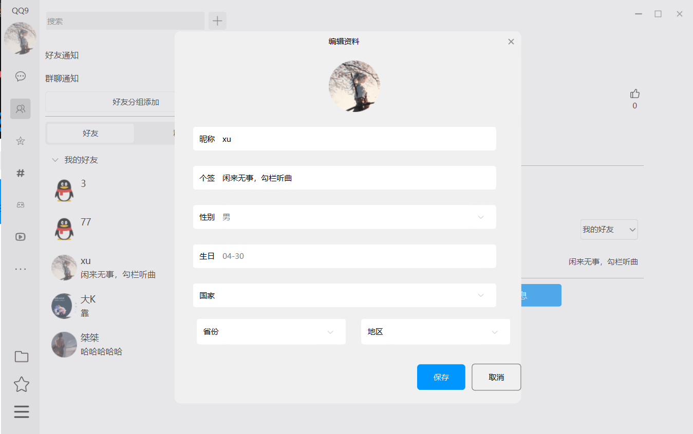

#基于Qt框架的仿QQ即时通信应用
支持个人账户的注册登录，信息编辑，实现私聊，群组群成员的增删改查及聊天,搜索等功能。
采用C/S架构,后端模块使用QWebSocketServer,QHttpServer混合通信,使用Json传输、解析数据,采用自定义数据库连接池实现MySql连接复用和负载均衡。

登录界面

通信界面

群组通信界面

搜索添加界面

好友搜索栏

通知界面

好友界面

个人信息编辑界面

群聊群成员面板

